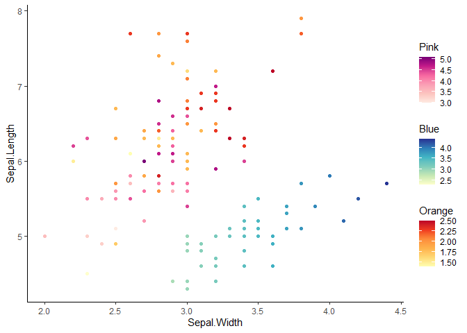
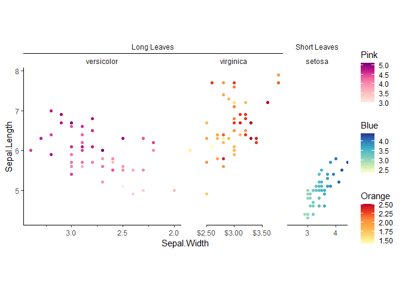

<!-- README.md is generated from README.Rmd. Please edit that file -->

# ggh4x 

<!-- badges: start -->

[](https://codecov.io/gh/teunbrand/ggh4x?branch=master)
[](https://github.com/teunbrand/ggh4x/actions)
[](https://CRAN.R-project.org/package=ggh4x)
<!-- badges: end -->

The ggh4x package is a ggplot2 extension package. It provides some
utility functions that are don’t entirely fit within the ‘grammar of
graphics’ concept —they can be a bit hacky— but can nonetheless be
useful in tweaking your ggplots. Examples include adjusting the sizes of
facets, mapping multiple aesthetics to colours and specififying
individual scales for facets. Besides this, it is also a small
collection of geoms, facets, positions, guides and stats.

## Installation

You can install the development version from
[GitHub](https://github.com/) with:

``` r
# install.packages("devtools")
devtools::install_github("teunbrand/ggh4x")
```

## Overview

There are a few topics explored in the package’s vignettes with
examples. Links to these topics are below.

-   Options to tailor
    [facets](https://teunbrand.github.io/ggh4x/articles/Facets.html),
    including:
    -   [Nested
        facets](https://teunbrand.github.io/ggh4x/articles/Facets.html#nested-facets)
        that have strips that can span multiple panels.
    -   Adjusting the [position
        scales](https://teunbrand.github.io/ggh4x/articles/Facets.html#position-scales)
        on a per-panel basis.
    -   Varying the [size of
        panels](https://teunbrand.github.io/ggh4x/articles/Facets.html#sizes)
        without being limited to the global `aspect.ratio` or fixed
        coordinates.
-   ggh4x has some [position
    guides](https://teunbrand.github.io/ggh4x/articles/PositionGuides.html)
    that change the way x- and y-axes look. You can:
    -   include the [minor breaks as minor tick
        marks](https://teunbrand.github.io/ggh4x/articles/PositionGuides.html#minor-ticks).
    -   detail log<sub>10</sub> axes with [logarithmic
        tickmarks](https://teunbrand.github.io/ggh4x/articles/PositionGuides.html#logarithmic-ticks).
    -   indicate [nested
        relations](https://teunbrand.github.io/ggh4x/articles/PositionGuides.html#nested-relations)
        in discrete axes.
    -   mirror the results of hierarchical clustering with [dendrogram
        axes](https://teunbrand.github.io/ggh4x/articles/PositionGuides.html#dendrograms)
        with help from the **ggdendro** package.
-   There are some [stat
    layers](https://teunbrand.github.io/ggh4x/articles/Statistics.html)
    that can make it easier to plot. These stat layers can:
    -   overlaying the [theoretical
        density](https://teunbrand.github.io/ggh4x/articles/Statistics.html#theoretical-densities)
        of several distributions, which are computed with the
        **fitdistrplus** package.
    -   draw a trendline of your data with a [rolling
        kernel](https://teunbrand.github.io/ggh4x/articles/Statistics.html#rolling-kernels).
    -   plainly [transform x and
        y](https://teunbrand.github.io/ggh4x/articles/Statistics.html#function-x-y)
        position in a group-wise manner.
    -   calculate [run-length
        encodings](https://teunbrand.github.io/ggh4x/articles/Statistics.html#run-length-encoding)
        of your data.

## Example

Below you’ll find an example that illustrates some of the features of
ggh4x.

``` r
library(ggh4x)
#> Loading required package: ggplot2
library(scales)

df <- transform(
  iris, 
  Nester = ifelse(Species == "setosa", "Short Leaves", "Long Leaves")
)

# Basic plot
g <- ggplot(df, aes(Sepal.Width, Sepal.Length)) +
  theme_classic() +
  theme(strip.background = element_blank())

# For making a plot with multiple colour scales, we'd first need to make layers
# with alternative aesthetics. We'll choose a colour scale for every species.
# This will produce a few warnings, as ggplot2 doesn't know how to deal with
# the alternative aesthetics.
g <- g + 
  geom_point(aes(SW = Sepal.Width),
             data = ~ subset(., Species == "setosa")) +
  geom_point(aes(PL = Petal.Length),
             data = ~ subset(., Species == "versicolor")) +
  geom_point(aes(PW = Petal.Width),
             data = ~ subset(., Species == "virginica"))
#> Warning: Ignoring unknown aesthetics: SW
#> Warning: Ignoring unknown aesthetics: PL
#> Warning: Ignoring unknown aesthetics: PW

# These alternative aesthetics don't mean a lot until we add a multi-colour
# scale to the plot. We need to specify our alternative aesthetics and colours
# for every scale. Arguments provided as lists are passed on to individual 
# scales.
g <- g +
  scale_colour_multi(
    aesthetics = c("SW", "PL", "PW"),
    name = list("Blue", "Pink", "Orange"),
    colours = list(
      brewer_pal(palette = "YlGnBu")(6),
      brewer_pal(palette = "RdPu")(6),
      brewer_pal(palette = "YlOrRd")(6)
    ),
    guide = guide_colorbar(barheight = unit(50, "pt"))
  )
g
```



``` r
# We can make a facet wherein duplicated strip labels are merged into one strip
g <- g + 
  facet_nested(~ Nester + Species, scales = "free",
               nest_line = TRUE)

# Like we did for colours, we might also want to set position scales for every
# panel individually. We set these in the same order the facets appear in.
position_scales <- list(
  scale_x_reverse(guide = "axis_minor"),
  scale_x_continuous(labels = dollar, guide = "axis_truncated"),
  scale_x_continuous(breaks = c(3, 4), expand = c(0,0))
)

# Adding the list of scales to the plot
g <- g + facetted_pos_scales(x = position_scales)

# Setting the sizes of panels individually
size <- 2 / (1 + sqrt(5))
g <- g + force_panelsizes(cols = c(1, size, size ^ 2), respect = TRUE)
g
```



## Footnote

I would like to mention that there are also packages that do some
similar things to what this package does.
[facetscales](https://github.com/zeehio/facetscales) also has a facet
function wherein scales can set per row/colum. The
[relayer](https://github.com/clauswilke/relayer) and
[ggnewscale](https://github.com/cran/ggnewscale) packages also allow
multiple colour scales in the same plot.

Historically, many of these functions come from the
[ggnomics](https://github.com/teunbrand/ggnomics) package, but have been
moved here as a package independent of Bioconductor infrastructure.
